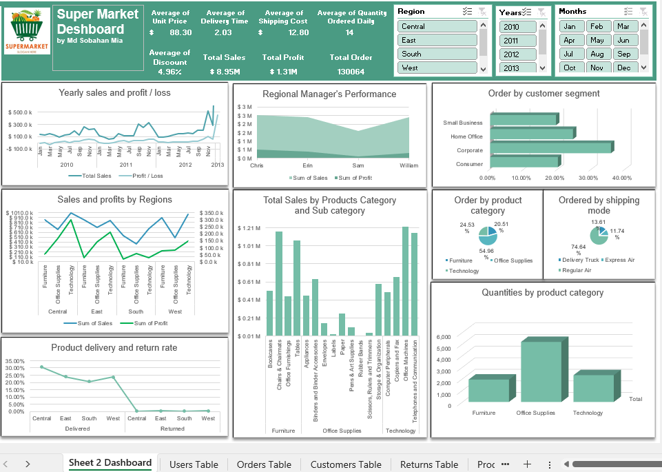

# Super Market Dashboard

This project provides an interactive dashboard that visualizes key performance metrics for a supermarket. It helps stakeholders analyze yearly sales, profits, customer segments, product categories, and regional performance. This tool is ideal for understanding business performance trends, customer preferences, and operational efficiency.

---

## Dashboard Overview

The dashboard covers sales data from 2010 to 2013 and includes multiple filters for deeper exploration. The main components include metrics on sales, profit, average pricing, order details, and product delivery rates.

### Key Metrics
- **Average Unit Price**: $88.30
- **Average Delivery Time**: 2.03 days
- **Average Shipping Cost**: $12.80
- **Average Quantity Ordered Daily**: 14 units
- **Total Sales**: $8.95M
- **Total Profit**: $1.31M
- **Total Orders**: 130,064
- **Average Discount**: 4.96%

---

## Dashboard Components

### 1. Yearly Sales and Profit/Loss
- Displays trends in total sales and profit over time, helping to identify seasonal patterns and growth trends.
- Sharp increases in specific months may highlight peak shopping seasons or promotional periods.

### 2. Regional Manager's Performance
- Compares the performance of regional managers (Chris, Erin, and William) in terms of sales and profit.
- This can help identify which manager's region is contributing the most to sales and profit.

### 3. Order by Customer Segment
- Breaks down orders by customer segments (Small Business, Home Office, Corporate, and Consumer).
- Consumer and Corporate segments are the largest, accounting for a substantial portion of total orders.

### 4. Sales and Profits by Regions
- Displays sales and profit trends across regions (Central, East, South, West) for each product category.
- Allows comparison of regional performance, with certain regions excelling in specific product categories.

### 5. Total Sales by Product Category and Sub-Category
- Shows sales volume across different product categories and sub-categories.
- Office Supplies leads in sales, followed by Technology and Furniture.

### 6. Product Delivery and Return Rate
- Visualizes delivery and return rates by region, helping to monitor product fulfillment and customer satisfaction.
- Central and East regions have higher delivery rates, while returns vary by region.

### 7. Order by Product Category
- Pie chart showing the distribution of orders by product category (Furniture, Office Supplies, Technology).
- Office Supplies is the largest category, followed by Technology and Furniture.

### 8. Ordered by Shipping Mode
- Analyzes customer preferences in shipping mode: Regular Air, Delivery Truck, and Express Air.
- Regular Air is the most commonly used mode (74.64%).

### 9. Quantities by Product Category
- Displays ordered quantities by product category, with Office Supplies having the highest quantity ordered, followed by Technology and Furniture.
- Highlights popular product categories and inventory demand.

---

## Filters and Interactivity

The dashboard includes interactive filters for:
- **Region** (Central, East, South, West)
- **Years** (2010–2013)
- **Months** (Jan–Dec)

These filters allow users to narrow down data by specific time frames, regions, and other dimensions, making it easy to analyze specific periods and segments.

---

## Key Insights

- **Sales Growth**: The data reveals consistent growth in sales over the years, with noticeable peaks in specific months that likely align with seasonal demand.
- **Regional Performance**: Different regions excel in specific product categories; for example, Office Supplies perform well in most regions.
- **Customer Segment Dominance**: Corporate and Consumer segments are prominent, indicating a balanced mix of B2B and B2C sales.
- **Delivery and Returns**: Central and East regions show high delivery rates, but returns vary, which could inform strategies to reduce returns in certain areas.
- **Shipping Preferences**: Regular Air is preferred by most customers, possibly due to cost-effectiveness or standard delivery times.

---

## How to Use the Dashboard

1. Clone the repository and open the dashboard in Power BI or compatible BI software.
2. Utilize the filters to explore specific data by region, year, and month.
3. Review each visualization for insights on performance trends, customer behavior, and product demand.

---

## Author : Md Sobahan Mia

## Conclusion

The Super Market Dashboard provides an in-depth view of supermarket performance across multiple dimensions, supporting strategic decisions in sales, operations, and customer engagement.

